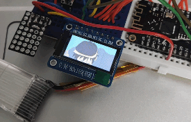

<p align="center">
  
  <p align="center">
  <small>The clip played is from The Melancholy of Haruhi Suzumiya (2009). </small>
  </p>
</p>

# Endless Endless Eight

A self-sustained AVI player to replay the summer days.

- ESP32 to play MJPEG-AVI video files from microSD at 24 fps.
- Utilizes ULP coprocessor for BAT voltage monitoring, Deep Sleep management etc.
- 5V solar panel and small LiPo battery as the main power source.
- (Planned) LTC3130-1 for more efficient power conversion.

## BOM

**WIP**
- ESP32 WeMos LOLIN32 Lite
- ST7735 80x160 LCD module
- microSD card (>= 2 GB)
- 5V 2W solar panel

## Prepare video files

All the video files to be placed on the MicroSD must be MJPEG-encoded AVI.

```sh
# Transcode EP 12~19 to ee_%d.avi, with scaling and cropping
$ seq 12 19 | xargs -L 1 -P1 -I% bash -c 'ffmpeg -i ee_%.mp4 -r 24 -vf scale=160:-1,crop=160:80 -vcodec mjpeg -q:v 5 -an ee_%.avi -y'
```

See [sdcard/](./sdcard/) for a set of sample vid files. These are converted from [BigBuckBunny.mp4](http://commondatastorage.googleapis.com/gtv-videos-bucket/sample/BigBuckBunny.mp4).
```sh
# The sample vid files were from
$ seq 12 19 | xargs -L 1 -P1 -I% bash -c 'ffmpeg -ss $(((% - 12)*2)) -to $(((% - 12 + 1) * 2)) -i BigBuckBunny.mp4 -r 24 -vf scale=160:-1,crop=160:80 -vcodec mjpeg -q:v 5 -an ee_%.avi -y'
```

## Build firmware

```sh
$ git clone https://github.com/likeablob/endless-endless-eight.git
$ cd endless-endless-eight

$ cp include/user_config.g.template cp include/user_config.h
$ code include/user_config.h

$ pio run && pio run  
$ pio run -t upload
```

## LICENSE

MIT


## Dependencies
This projects is here thanks to a lot of superb OSS libraries.
See [platformio.ini](./platformio.ini) for details. Thank you to all the devs.
