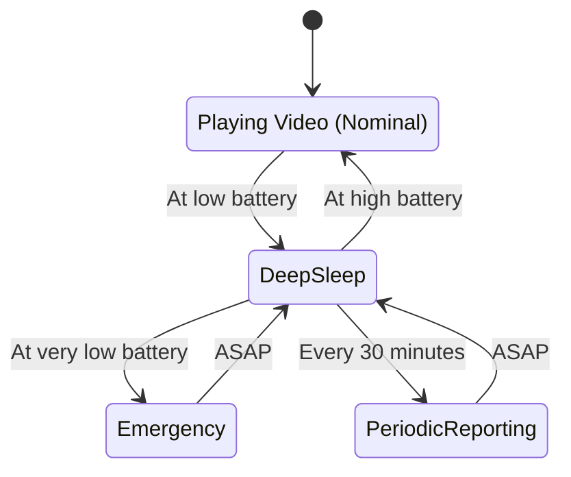
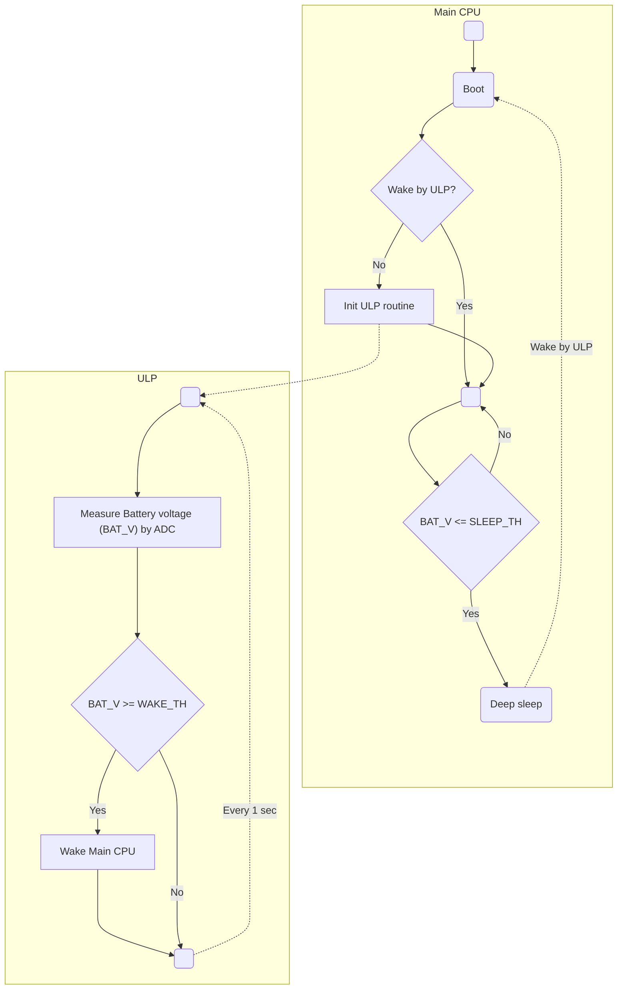
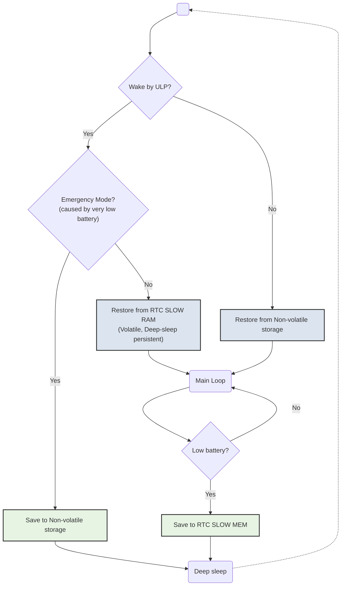

<p align="center">
  
  <p align="center">
  <small>The clip played is from The Melancholy of Haruhi Suzumiya (2009). </small>
  </p>
</p>

# Endless Endless Eight

A self-sustained AVI player to replay the summer days.

- ESP32 to play MJPEG-AVI video files from microSD at 24 fps.
- Utilizes ULP coprocessor for BAT voltage monitoring, Deep Sleep management etc.
- 5V solar panel and small LiPo battery as the main power source.
- (Planned) LTC3130-1 for more efficient power conversion.

## BOM

**WIP**

- ESP32 WeMos LOLIN32 Lite
- ST7735 80x160 LCD module
- microSD card (>= 2 GB)
- 5V 2W solar panel

## Prepare video files

All the video files to be placed on the MicroSD must be MJPEG-encoded AVI.

```sh
# Transcode EP 12~19 to ee_%d.avi, with scaling and cropping
$ seq 12 19 | xargs -L 1 -P1 -I% bash -c 'ffmpeg -i ee_%.mp4 -r 24 -vf scale=160:-1,crop=160:80 -vcodec mjpeg -q:v 5 -an ee_%.avi -y'
```

See [sdcard/](./sdcard/) for a set of sample vid files. These are converted from [BigBuckBunny.mp4](http://commondatastorage.googleapis.com/gtv-videos-bucket/sample/BigBuckBunny.mp4).

```sh
# The sample vid files were from
$ seq 12 19 | xargs -L 1 -P1 -I% bash -c 'ffmpeg -ss $(((% - 12)*2)) -to $(((% - 12 + 1) * 2)) -i BigBuckBunny.mp4 -r 24 -vf scale=160:-1,crop=160:80 -vcodec mjpeg -q:v 5 -an ee_%.avi -y'
```

## Build firmware

```sh
$ git clone https://github.com/likeablob/endless-endless-eight.git
$ cd endless-endless-eight

$ cp include/user_config.g.template cp include/user_config.h
$ code include/user_config.h

$ pio run || pio run # The very 1st run may fail due to ulptool-pio
$ pio run -t upload
```

## Print enclosure

See [./enclosure](./enclosure).

## How it works

### State transitions

Centering on the deep sleep mode, this application has several wake-up states as depicted in the following diagram.

- The application switches back-and-forth between the nominal mode and deep sleep depending on the battery voltage. (See [Power management strategy](#power-management-strategy) for details.)
- Also, under the certain condition, it wakes in;
  - Emergency mode to prepare for a complete power loss (See [State persistence](#state-persistence))
  - Periodic Reporting mode for reporting housekeeping data via MQTT
- Basically every wake up transition is triggered by the ULP routine.



### Power management strategy

It's quite simple; Wake the Main CPU up if `the battery voltage (BAT_V) >= 3.9 V` and put into sleep if `BAT_V <= 3.75 V`.  
The ULP co-processor executes own routine every one second, but still is able to keep the deep sleep current consumption at uA-level.



### State persistence

The play state such as a file playing, its position and loop count etc. are kept over deep sleep or even complete power outage, thanks to ~~Nagato~~ [RTC SLOW MEM](https://docs.espressif.com/projects/esp-idf/en/latest/esp32/api-reference/system/sleep_modes.html#overview) and [Non-Volatile Storage](https://docs.espressif.com/projects/esp-idf/en/latest/esp32/api-reference/storage/nvs_flash.html). The former is volatile but survives deep sleep, and the latter is nothing but a reserved region in flash.

In short there are two pathways for each storage.

- A. Save to `RTC_SLOW_MEM` before entering deep sleep. Restore from `RTC_SLOW_MEM` after waking up from deep sleep.
- B. Save to `NVS` at very-low battery voltage. Restore from `NVS` on boot.

Note: About B., the ULP routine wakes the main CPU in the Emergency mode when `BAT_V <= 3.55 V`. This happens only once and the related flag will be cleared by the main CPU after normal wake up.



## LICENSE

MIT

## Dependencies

This projects is here thanks to a lot of superb OSS libraries.
See [platformio.ini](./platformio.ini) for details. Thank you to all the devs.
